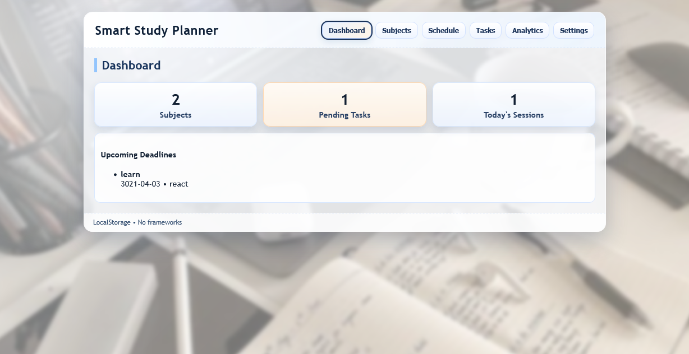

# Smart Study Planner

A simple study planner built with HTML, CSS, and vanilla JavaScript. All data is stored locally in the browser (LocalStorage).

Quick start
- Open `index.html` in a modern browser (or use a static server / Live Server).

Usage (demo steps)
1. Add a subject in **Subjects**.
2. Add a study session on a day and time in **Schedule**.
3. Add a task with a deadline in **Tasks**, then mark it Done when complete.
4. Use **Export** to save a copy of your data as JSON.

Data model & storage
- LocalStorage keys: `sp_subjects`, `sp_tasks`, `sp_sessions`, `sp_settings`.
- `subjects`: [{ id, name, priority }]
- `tasks`: [{ id, title, subjectId, deadline, done }]
- `sessions`: [{ id, subjectId, day, start, end }]

Grading pointers (what to show)
- UI/UX: show responsive layout, clear labels, dark theme toggle.
- JS logic: show LocalStorage persistence and conflict handling for sessions.
- Features: show Dashboard counts, Upcoming deadlines, Export/Import.

Files to submit
- `index.html`, `styles.css`, `app.js`, `README.md`, and `ss.png` (screenshot).

Presentation notes (short)
- Explain the objective and data model (2–3 sentences).
- Demonstrate adding a subject, scheduling a session, and creating a task.
- Show that data persists after refresh and use Export to save JSON.

Notes
- No external libraries. Works offline in the browser.

Good luck — open the app and show the three demo steps above.